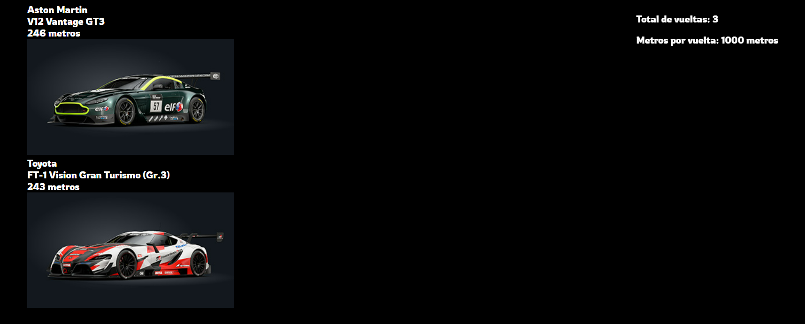

## Javascript racing game

Este repositorio contiene el código fuente de un juego basado en HTML, CSS y JavaScript.
Realizado durante mi formación en el bootcamp de GeeksHubs Academy.



## Descripción

El juego consiste en varias pantallas:

- `Pantalla de incio:` En esta pantalla tendremos un botón(CTA) que al clicarlo nos llevará a la pantalla siguiente.

- `Pantalla de selección de equipos:` Cada equipo eligirá un coche y cuando todos lo hayan seleccionado pasaremos a la siguiente pantalla.

- `Pantalla de juego:` En esta pantalla se mostraran los coches que participan ordenados por los metros que hayan recorrido. Al pulsar la tecla de la flecha derecha todos los vehículos de la carrera avanzaran los metros de manera aleatoria.
  Conforme los jugadores termninan estarán temporalmente en un ranking. El juego termina cuando todos los coches han recorrido los metros totales de la carrera. Para modificar los parámetros de la carrera podemos modificar el siguiente objeto:

```js
const raceConfiguration = {
  steps: 3,
  stepMeters: 1000,
};
```

- `Pantalla de ranking:` En esta pantalla se mostrarán todos los vehículos que participaron en la carrera ordenado por su posición de llegada.

### Despliegue/puesta en marcha:

- Servir los archivos estáticos en un servidor HTTP(en visual studio code lo podemos servir con el plugin live server)

#### Cambios a futuro:

- Añadir movilidad a los vehículos.
- Mejorar el estilo CSS.
- Organizar mejor el código js (usar clases para encapsular lógica?)
